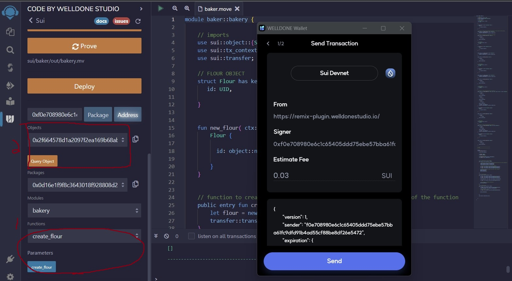

# *SUI_Move_Bootcamp_Final_Project*
---
---

---
---

# Project Overview:

Welcome to the BAKERY, where to get that BREAD, first you gotta’ make some DOUGH. 

This project uses the SUI Move language to allow a user to create objects with the intention of finally creating the rarest object, Bread. 
Currently each object is defined by a struct and have functions to allow the object to be created and transferred, as well as deconstructed and deleted. 
First the user needs to create a Flour, Salt, and Yeast object to call the create_dough function. When the create_dough function is called the Flour, Salt, and Yeast objects get deconstructed and deleted and the Dough object is created. When the user calls the create_bread function, they must have a Dough object, and they pass their Dough object to the create_bread function which deconstructs and deletes the Dough object and returns a Bread object.

---
---

# The explanation of the project including the aim of the project:

The aim of the project is to demonstrate exchanging an object or objects for another object while deleting the first object/s, thus creating the illusion of transforming objects. In this project the goal is to be able to create simple objects and progressively transform them into more complex, and rare objects. The Flour, Salt, and Yeast can be transformed into Dough which can then be transformed into Bread.

Due to testing and building limitations due to the Random.Move bug described more below, (As of 12/11/23 is said to being fixed within a week of today), development was slowed on on the next step of this project. The next steps of this project will be to accept Sui in exchange for creating the objects, create an admin object passed in the contract's init function to enable the contract deployer to access the Sui spent to purchase objects, and create game_ids for all the objects created. The final steps that will be completed is to build out frontend using the Suiet library, and to use the Display library recently released by Sui Move to and attach an URL image for the various objects, showing Bread as the most rare.

---
---

# The devnet contract address:

As a Windows/ Linux VM user after needing to reinstall the SUI binaries I have received the known error pertaining to the Random.Move file. 

Being on the SUI Discord and asking about the issue I see it is a known issue with some workarounds proposed, but I was unable to get them to work.

The work around is to comment out these lines in the fun create(ctx: &mut TxContext) in the Random.Move file found at:

    /home/userName/.move/https___github_com_MystenLabs_sui_git_framework__devnet/crates/sui-framework/packages/sui-framework/sources

The workaround:

    // let inner = RandomInner {
    //     version, 
    //     epoch: tx_context::epoch(ctx),
    //     random_bytes: vector[],
    // };
  
    // let self = Random {
    //     id: object::randomness_state(),
    //     inner: versioned::create(version, inner, ctx),
    // };
    // transfer::share_object(self)

  Then to build use this command:

    sui move build --skip-fetch-latest-git-deps

  
  Unfortunately this work around does not allow you to publish a contract due to the random.move file being different to the on-chain version:
  
  

  Luckily the move-analyzer is very helpful in debuggint the Sui Move code in VS Code as you develop. 
  
  To publish a Sui Move package without the Random.Move error using the cli is done by the following command:
  
    sui client publish --gas-budget 10000000
   
  After the package is compiled it can be checked in the SUI explorer. To publish the package you also need to have an 
  account with a positive sui balance. When you first publish a package in VS Code a new wallet is set up and to receive Sui to the new devnet wallet you 
  can go to the Sui discord and in the channel for the Sui devnet faucet enter the command:
  
      !faucet 0xaddress
  
  Where the, 0xaddess is your wallet address. You can also import the account into the Welldone wallet using the wallet's mnemonic phrase, and then using the faucet 
  that is in the Welldone wallet through clicking the faucet icon.

---
---

# How to set up the project. In this part, you can also share the following link for Move on Sui setup: Install Sui to Build | Sui Docs:

  To install sui onto a Linux system or windows with wsl/ Ubuntu one follows the instructions found at:

    https://docs.sui.io/guides/developer/getting-started/sui-install

  Following the instructions first the prerequisites are installed for the OS then the binaries can be installed from source. 

  Due to the current known bug currently the binaries from source have not been installing correctly for me and there is an error when building the binaries.
  As a result I used the --force flag on an older devnet version to be able to build a package on my machine after modifying the Random.Move file.
  
    cargo install --locked --git https://github.com/MystenLabs/sui.git --tag devnet-v1.13.0 sui --force
  
  The work around for the Random.Move file is explained above. 
  
---
---

# How to run the project:

To build a Sui Move project the normal command is:

    sui move build
    
However, as a result of the known bug and not getting the Sui binaries to properly install on my machine it gave me the unique ability to use the Welldone wallet on the Remix IDE. With the Welldone wallet it is possible to create a multitude of template projects but I chose the basic which created an empty source folder and an empty Move.toml file. The project built using this method allowed the functions to be tested but gave limited access to the #[test] functions. 

First you need to set the Welldone wallet to developer mode.

Below it can be shown after the file is compiled it appears in the area marked by number 1. Then after deploying the contract the objects, functions, ext. become visible in the area marked with the number 2. 

Here is shown the creation of an object, Flour. Each of the objects, Flour, Salt, Yeast, Dough, and Bread are structurally very similar minus the fact it takes the objects of Flour, Salt, and Yeast to make Dough, and it takes Dough to make the Bread object. 

After the object is created it can then be queried and the object details can be seen such as the UID for the particular object. Below is a picture of querying the Flour object that was created above.

    
---
---

# How to test the project.

Unfortunately, one area where the Welldone wallet in Remix seemed to fall short in my experience was in testing. I could get a contract with tests to compile but I was unable to get the tests themselves to run which limited my development experience greatly. In the cli in Ubuntu using the following command in the project should run the unit tests below the #[test] statement:

    sui move test

As the Random.Move error becomes fixed I will be able to run and see the results from the unit test functions in the contract.

**Structure of Tests**

Sets up the testing environment for the unit tests

Test the objects Flour, Salt, Yeast object and deletes them 

Test the objects Dough, Bread object and deletes them then closes the testing environment

