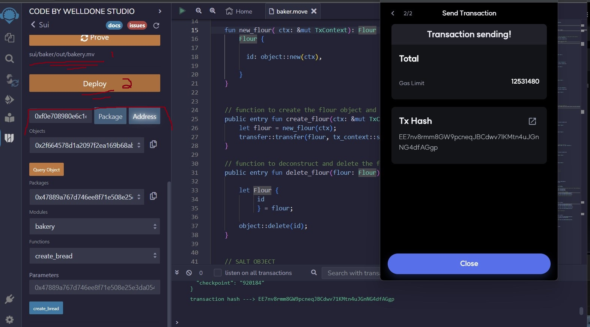

# SUI_Move_Bootcamp_Final_Project

# **Project Overview:**

---
---

# **The explanation of the project including the aim of the project:**

---
---

# **The devnet contract address:**

As a Windows/ Linux VM user after needing to reinstall the SUI binaries I have recieved the known error pertaining to the Random.Move file. 

Being on the SUI Discord and asking about the issue I see it is a known issue with some workarounds proposed, but I was unable to get them to work.

The work around is to comment out these lines in the fun create(ctx: &mut TxContext) in the Random.Move file:

    // let inner = RandomInner {
    //     version, 
    //     epoch: tx_context::epoch(ctx),
    //     random_bytes: vector[],
    // };
  
    // let self = Rnadom {
    //     id: object::randomness_state(),
    //     inner: versioned::create(version, inner, ctx),
    // };
    // transfer::share_object(self)

  Then to build use this command:

    sui move build --skip-fetch-latest-git-deps

  To built Sui move package I would then use the command: 
  
        sui move build --skip-fetch-latest-git-deps
  
  Unfortunately this work around does not et you publish a contract sue to the same issue again:
  

  This would be the command to publish a contract and then it ould be checked on the SUI explorer:
  
        sui client publish --gas-budget 10000000
   
  After the package is copiled it can be checked in the SUI explorer. To publish the package you also need to have an 
  account with sui in it. When you first publish a package a new wallet is set up and to recieve sui to the devnet you 
  can go to the sui discord and in the channel for the sui devent fauce enter the command, !faucet 0xaddress, where the 
  0xaddess is your wallet address. You can also import the account into the welldone wallet and use the faucet that is 
  in the welldone wallet by clicking the faucet icon.

---
---

# **How to set up the project. In this part, you can also share the following link for Move on Sui setup: Install Sui to Build | Sui Docs:**

As a reuslt of the knwon bug and not getting the SUI binaries to properly install on my machine it gave me the unique ability to use the Welldone wallet on the Remix IDE. With the Welldone wallet it is possible to crete a multiude of template projects but i chose the basic which created an empty source folder and an empty Move.toml file. 
The project built using this method allowed the functions to be tested but gave limited access to the #[test] functions. 
Below it can be shown after the file is compiled it appears in the area marked by number 1. Then after deploying the contract the objects, functions, ext. become visible in the area marked with the number 2. 

Here is shown the creation of an object, Flour. Each of the objects, Flour, Salt, Yeast, Dough, and Bread are structurally very similar minus the fact it takes the objects of Flour, Salt, and Yeast to make Dough, and it takes Dough to make the Bread object. 

After the object is created it can then be queried and the object details can be seen such as the UID for the particualt object. Below is a picture of querying the Flour object that was created above.

---
---

# **How to run the project:**

The project can be run by first building the project woth 

        sui move build
   
and the project can have the functions called using the Remix IDE with the Welldone wallet. The funcitons allow the for the creation and deletion of the objects in the file.
    
---
---

# **How to test the project.**

        sui move test

  will run the tests located at the bottom of the file. 

